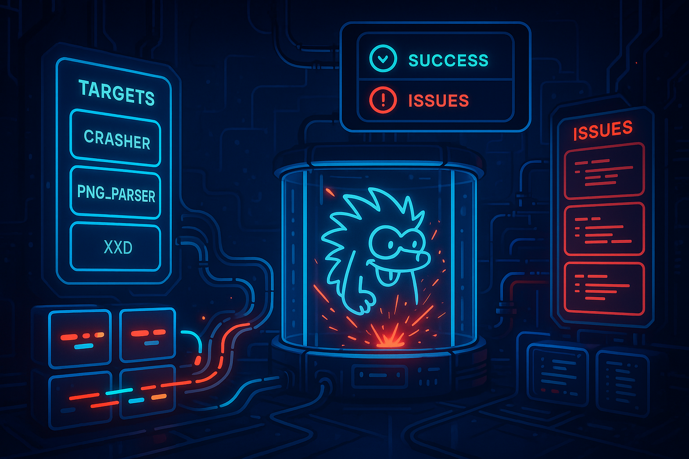
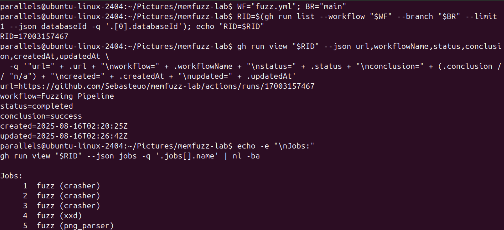
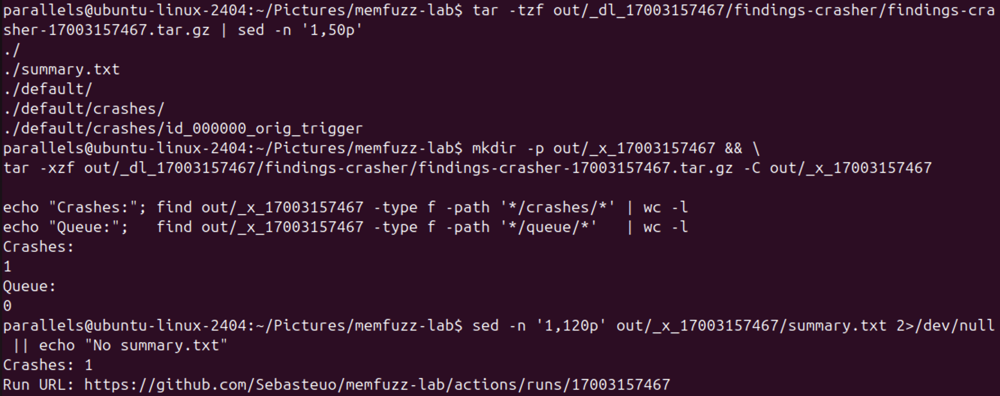
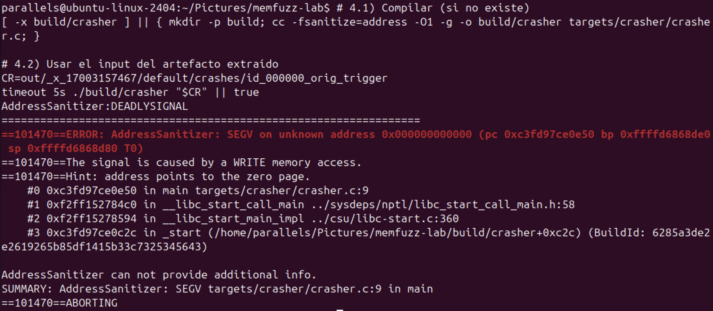
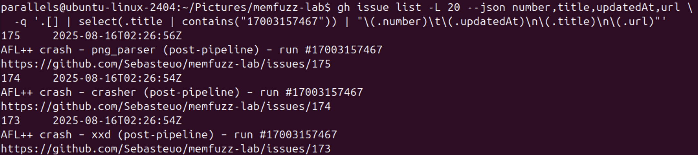
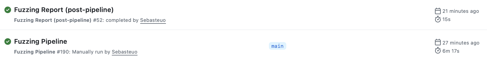
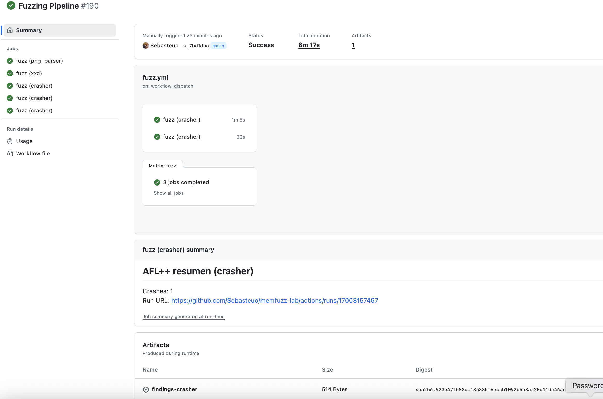
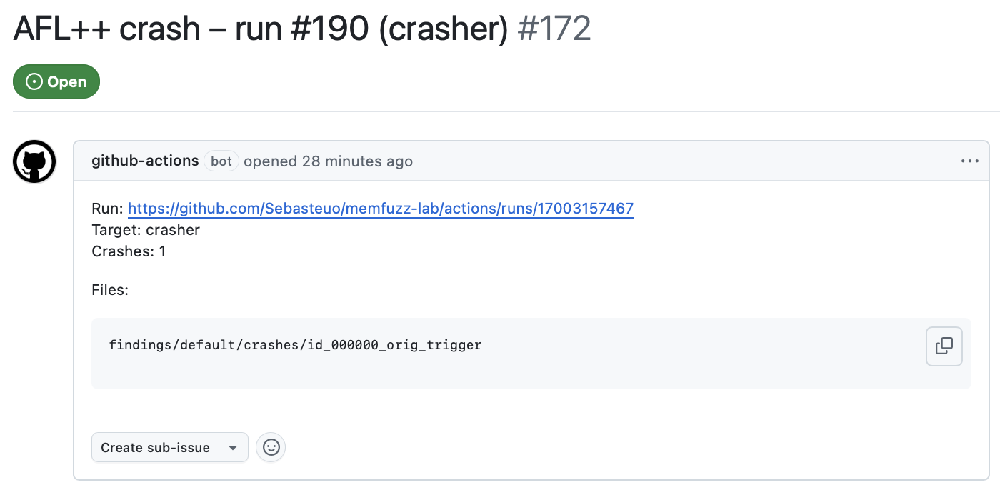
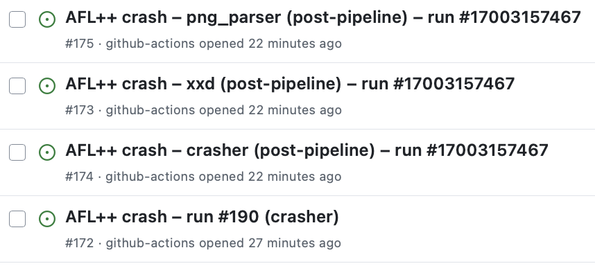

# memfuzz-lab

[](https://github.com/Sebasteuo/memfuzz-lab/actions/workflows/fuzz.yml)

> ℹ️ **Note:** The `fuzz.yml` badge may often show **failing**.  
> This is expected — a “failure” indicates that AFL++ successfully triggered crashes.  
> Crashes are packaged as artifacts and GitHub Issues are opened automatically for triage.

<p align="center">
  
</p>

**memfuzz-lab** is a CI-driven fuzzing lab that integrates **AFL++**, **AddressSanitizer**, **QEMU-user mode**,and **GitHub Actions**.  
Every push runs fuzzing jobs (native and cross-arch with QEMU), uploads crash artifacts, and automatically opens Issues with stack traces and reproducible inputs.

---

## Features
- ⚡ **Push-to-fuzz**: automated AFL++ runs on GitHub Actions  
- 🧩 **Multi-target matrix**: `crasher`, `png_parser`, `xxd`  
- 📦 **Artifacts**: crashes + corpus stored per run  
- 🐛 **Auto Issues**: one per target/run, with symbolic stack traces  
- 🔁 **Reproducible**: artifacts replay crashes locally with ASan  

---

> ℹ️ This repo provides two workflows:
> - **Fuzzing Quick Demo** (`fuzz_quick.yml`) – manual run, guarantees a crash, always uploads artifacts & opens an Issue. Great for trying it out in 1 minute.
> - **Fuzzing Pipeline** (`fuzz.yml`) – full multi-target fuzzing (`png_parser`, `xxd`, `crasher`), runs on push to `main`.


## Quick start
1. Push changes → triggers the main fuzzing pipeline (`.github/workflows/fuzz.yml`).
2. Post-processing workflow (`.github/workflows/fuzz_report.yml`)  
   downloads artifacts, counts crashes per target, and opens Issues with links and inputs.

---

## Demo (CLI workflow)

### 1. Run & summary
```bash
gh workflow run fuzz.yml --ref main -f fuzz_timeout="2m"
RID=$(gh run list --workflow fuzz.yml --limit 1 --json databaseId -q '.[0].databaseId')
gh run view "$RID"

```



### 2. Download artifacts
```bash
mkdir -p out/_dl_$RID
gh run download "$RID" -D out/_dl_$RID
find out/_dl_$RID -maxdepth 3 -type f -print
```

### 3. Inspect contents
```bash
tar -tzf out/_dl_$RID/findings-crasher/findings-crasher-$RID.tar.gz | sed -n '1,50p'
mkdir -p out/_x_$RID && \
tar -xzf out/_dl_$RID/findings-crasher/findings-crasher-$RID.tar.gz -C out/_x_$RID

```



### 4. Local repro with ASan
```bash
[ -x build/crasher ] || { mkdir -p build; cc -fsanitize=address -O1 -g -o build/crasher targets/crasher/crasher.c; }
CR=out/_x_$RID/default/crashes/id_000000_orig_trigger
timeout 5s ./build/crasher "$CR" || true

```



### 5. Auto Issue
```bash
gh issue list -L 20 --json number,title,updatedAt,url \
  -q '.[] | select(.title | contains("'"$RID"'")) | "\(.number)\t\(.updatedAt)\n\(.title)\n\(.url)"'

```



## Demo (Github GUI)

### Runs list


### Run details


### Single Issue


### Issues list

